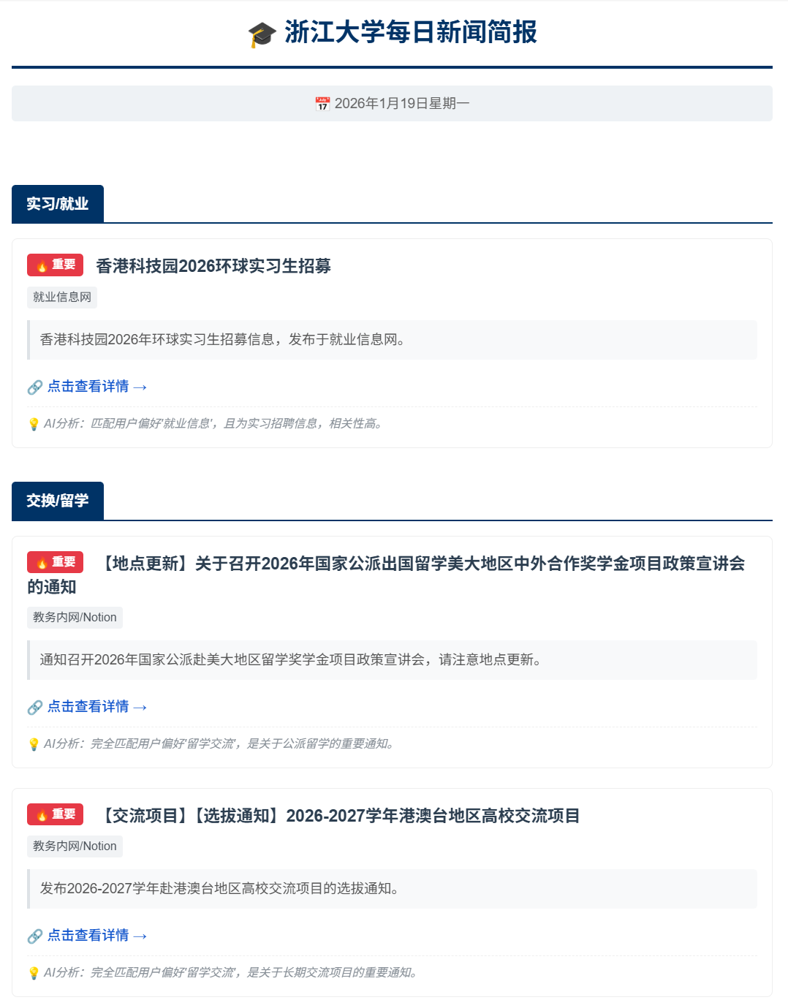
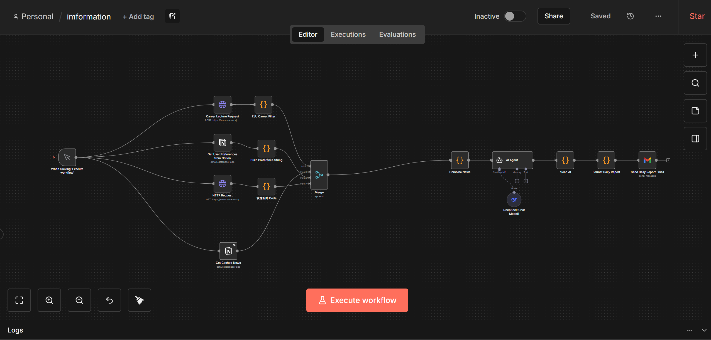

# 🎓 浙江大学每日新闻自动聚合助手 (ZJU News Agent)

> 🚀 **拒绝信息焦虑，不再错过任何重要通知。** 基于 n8n + DeepSeek + Notion 的自动化情报系统，专为浙大学子打造。

 
 

## 📖 项目背景与初衷

### 😫 你的痛点，我都懂

作为一名浙大学生，你是否也经历过以下崩溃时刻？

* **信息源太散**：教务网、办公网、学院官网、就业网、团委公众号……几十个网站，根本刷不过来。

* **关键信息遗漏**：因为几天没看内网，**错过了对外交流项目的申请截止时间**，或者**忘记了四六级报名**。

* **信息过载**：每天几百条通知，90% 都是与你无关的（比如文学院的同学不关心计算机的讲座，反之亦然）。

### 💡 解决方案：AI 驱动的个性化情报局

我认为，在这个 AI 时代，信息不应该只是简单的“搬运”，更应该被**理解**和**筛选**。

本项目不仅仅是一个爬虫，它引入了 **Notion** 来记录你的个人偏好（如专业、年级、关注领域），并利用 **DeepSeek 大模型** 进行深度推理。

**它能做到：**

1. **全网聚合**：利用油猴脚本穿透内网鉴权，将散落在各处的通知统一收集。

2. **AI 智能推理**：不再是简单的关键词匹配。
   
   * _场景举例_：如果你是**计算机学院**的学生，AI 会自动将“互联网+大赛”、“算法岗实习”标记为 🔥 **高优先级**；
   
   * 与此同时，它会自动折叠“人文社科基金申报”等对你无用的信息。

3. **精准推送**：每天定时生成一份**千人千面**的 HTML 日报，直接推送到你的邮箱。

* * *

✨ 核心特性
------

* **🕷️ 内网穿透采集**：配合 Tampermonkey 脚本，一键将 WebVPN/RVPN 内的通知保存至 Notion 数据库。

* **🧠 语义级筛选**：DeepSeek 模型能理解“申请截止”、“报名通知”等紧迫性词汇，自动提升优先级。

* **🎯 个性化定制**：在 Notion 中配置你的身份（如：`大三`、`CS专业`、`想出国`），AI 会据此为你量身定制日报。

* **📉 极简阅读体验**：自动过滤“无标题”、“第一页”等垃圾数据，并屏蔽“公示名单”等低价值噪音。

* **📧 移动端适配**：生成排版精美的 HTML 邮件，手机查看无压力。

* * *

🛠️ 技术架构
--------

本项目的核心逻辑是：**“进货 -> 仓库 -> 加工 -> 配送”**

1. **进货 (Frontend)**: `Tampermonkey` 脚本在浏览器端抓取内网数据（解决内网登录鉴权问题）。

2. **仓库 (Storage)**: `Notion Database` 作为中转站，暂存原始新闻和用户偏好。

3. **加工 (Backend)**: `n8n` 自动化工作流读取数据，调用 `DeepSeek API` 进行清洗、打分、摘要。

4. **配送 (Delivery)**: 生成 HTML 邮件并通过 SMTP 服务发送。

* * *

🚀 快速开始 (保姆级教程)
---------------

### ⚠️ 前置要求

* 拥有浙江大学内网 (WebVPN/RVPN) 访问权限。

* 拥有 Notion 账号。

* 拥有 DeepSeek 或 OpenAI 的 API Key。

* 本地或云端安装了 n8n。

### 第一步：准备 Notion 数据库 (共需 2 个)

本项目需要两个数据库：一个用于**存新闻**，一个用于**存你的偏好**。

#### 1. 新建“新闻存储库” (News Database)

用于存放油猴脚本抓取到的原始新闻。

* **创建方式**：新建 Database (Full page)。
* **必需字段** (列名必须完全一致，区分大小写)：

| 字段名 (Name)    | 类型 (Type)      | 说明                          |
|:------------- |:-------------- |:--------------------------- |
| **Name**      | `Text` (Title) | 新闻标题 (默认列)                  |
| **URL**       | `URL`          | 新闻链接                        |
| **PubDate**   | `Date`         | 发布日期                        |
| **Source**    | `Select`       | 来源 (如: 教务网)                 |
| **FetchTime** | `Created time` | **必须选 Created time** (用于排序) |

#### 2. 新建“用户偏好库” (User Preferences)

用于告诉 AI 你对什么感兴趣（如：计算机、留学、大三），AI 会根据这些关键词为你打分。

* **创建方式**：新建 Database (Full page) 或 Inline。
* **必需字段**：

| 字段名 (Name)   | 类型 (Type)      | 必填  | 说明                     | 示例数据                |
|:------------ |:-------------- |:--- |:---------------------- |:------------------- |
| **Name**     | `Text` (Title) | ✅   | **偏好关键词** (AI 将根据此词筛选) | "计算机", "大三", "留学"   |
| **Priority** | `Number`       | ✅   | **优先级** (数字越小越重要)      | 1 (高), 2 (中), 3 (低) |
| **Enabled**  | `Checkbox`     | ✅   | **开关** (勾选才生效)         | ✅ (勾选)              |
| **Category** | `Select`       | ❌   | 分类 (仅方便自己管理，可选)        | "专业", "年级", "兴趣"    |

> **💡 配置技巧**：
> 
> * 建议添加一条 **Priority=1** 的记录，名称为你的**学院/专业** (如 "计算机科学")。
> * 建议添加一条 **Priority=1** 的记录，名称为你的**年级** (如 "大三" 或 "2023级")，这样 AI 能识别针对特定年级的通知。
> * 想屏蔽的信息（暂不支持负向筛选），可以暂时不写，或将优先级设为低。

#### 3. 获取权限与 ID

1. 访问 [Notion Integrations](https://www.notion.so/my-integrations) 创建机器人，复制 `Secret Token`。
2. **关键步骤**：去**这两个数据库**的页面，分别点击右上角 `...` -> `Connect to` -> 选择你的机器人。
3. **记录 ID**：记下这两个数据库 URL 中间的那串 32 位字符，稍后 n8n 配置要用。
   * *News Database ID* -> 填入 n8n 的 `Get Cached News` 节点。
   * *Preferences Database ID* -> 填入 n8n 的 `Get User Preferences` 节点。

###第二步：安装油猴脚本 (数据采集器) 本项目提供两个脚本，分别用于不同的抓取场景。请确保浏览器已安装 [Tampermonkey](https://www.tampermonkey.net/) 插件。 

#### 📥 脚本下载

请在 `scripts/` 目录中找到脚本文件，或直接点击下方链接下载：

1. **[通用新闻抓取器 (zju-news-crawler.user.js)](./scripts/zju-news-crawler.user.js)** * *适用场景*：教务网、就业网、学院官网等普通网页。 

2. 2. **[WebVPN 交流项目抓取器 (zju-webvpn-crawler.user.js)](./scripts/zju-webvpn-crawler.user.js)** * *适用场景*：专门针对 WebVPN 下的对外交流项目列表进行了适配。 
      
      #### ⚙️ 配置脚本
      
      安装完成后，**必须**编辑脚本内容：
      
      1. 点击油猴图标 -> 管理面板 -> 编辑对应的脚本。 
      
      2. 找到代码顶部的 `CONFIG` 区域。 
      
      3. 填入你在第一步获取的 `NOTION_TOKEN` 和 `DATABASE_ID`。 
      
      4. 保存 (Ctrl+S)。

### 第三步：部署 n8n 工作流 (数据处理器)

1. **导入工作流**：
   
   * 下载本项目中的 `ZJU-News-Agent.json`。
   
   * 打开 n8n 面板，点击右上角菜单 -> **Import from file**。

2. **配置凭证 (Credentials)**：
   
   * **Notion**: 绑定你的 Notion 账号（用于读取数据）。
   
   * **DeepSeek/OpenAI**: 填入 API Key（用于 AI 分析）。
   
   * **Email**: 配置 SMTP 发件服务（如 QQ 邮箱、Gmail）。

3. **配置节点参数**：
   
   * 打开 `Get User Preferences from Notion` 节点，填入你的**偏好设置数据库 ID**（可选）。
   
   * 打开 `Get Cached News` 节点，填入你的**新闻数据库 ID**。

4. **调整 AI 模型**：
   
   * 确保 AI Agent 节点的 `Maximum Number of Tokens` 设置为 **8192** (防止日报截断)。

* * *

📝 日常使用流程
---------

1. **进货**：每天浏览内网通知时，点击右下角的 **"🏷️ 抓取本页"** 按钮。

2. **自动化**：n8n 会定时运行（建议设置 Cron 节点为每天晚上），读取 Notion 中的新数据。

3. **收货**：DeepSeek 分析处理后，你会在几分钟内收到一封整理好的日报邮件。

🛡️ 隐私说明
--------

* 本项目所有数据均存储在你个人的 Notion 和本地 n8n 中。

* **请勿**将包含 `secret_` Token 的代码上传到公共仓库。

* `ZJU-News-Agent.json` 文件已做脱敏处理，导入后需手动配置凭证。

🤝 贡献
-----

欢迎提交 PR 适配更多学院的网站结构，或优化 Prompt 提示词。
📄 License

----------

MIT License

## ⚖️ 免责声明 (Disclaimer)

1. **本项目仅供学术交流与个人学习使用**。项目开发者不鼓励也不支持任何违反《浙江大学校园网络管理办法》的行为。
2. **数据安全**：本项目所有数据抓取逻辑均运行在用户本地浏览器，数据存储在用户个人的 Notion 数据库中。开发者无法获取、也未存储任何用户的敏感数据。
3. **使用限制**：请使用者在合理范围内使用脚本，**严禁**高频抓取或进行恶意攻击（DDoS）。因使用本项目导致的账号封禁、IP 限制等后果，由使用者自行承担。
4. **版权说明**：抓取到的新闻内容版权归浙江大学及各源网站所有，本项目仅做聚合展示，不拥有内容版权。
